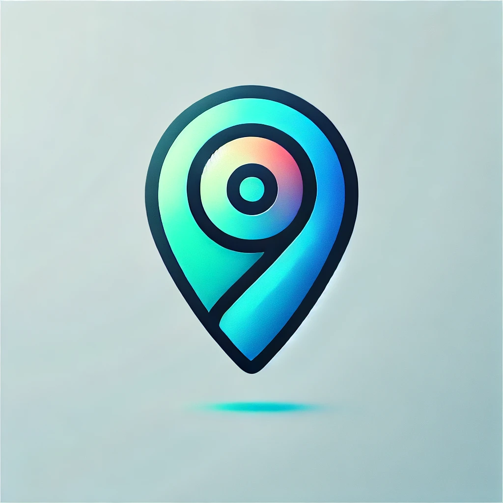
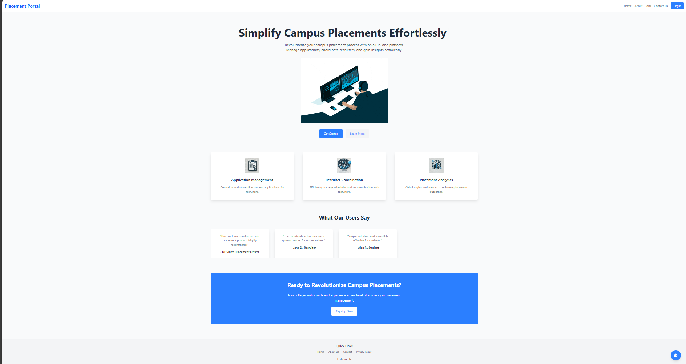

<a id="readme-top"></a>
[![Contributors][contributors-shield]][contributors-url]
[![Forks][forks-shield]][forks-url]
[![Stargazers][stars-shield]][stars-url]
[![Issues][issues-shield]][issues-url]
[![MIT License][license-shield]][license-url]

<!-- PROJECT LOGO -->
<br />
<div align="center">
  <a href="https://github.com/SathishAdithiyaaSV/PlaceMe">
    
  </a>

<h3 align="center">Place Me</h3>

  <p align="center">
 A centralized platform for streamlining campus placement processes, connecting students and recruiters for seamless application submission, interview scheduling, and communication.
    <br />
    <a href="https://github.com/SathishAdithiyaaSV/PlaceMe"><strong>Explore the docs »</strong></a>
    <br />
    <br />
    <!-- <a href="https://github.com/github_username/repo_name">View Demo</a> -->
  </p>
</div>


<!-- TABLE OF CONTENTS -->
<details>
  <summary>Table of Contents</summary>
  <ol>
    <li>
      <a href="#about-the-project">About The Project</a>
      <ul>
        <li><a href="#built-with">Built With</a></li>
      </ul>
    </li>
    <li>
      <a href="#getting-started">Getting Started</a>
      <ul>
        <li><a href="#prerequisites">Prerequisites</a></li>
        <li><a href="#installation">Installation</a></li>
      </ul>
    </li>
    <li><a href="#usage">Usage</a></li>
    <li><a href="#contributing">Contributing</a></li>
    <li><a href="#license">License</a></li>
  </ol>
</details>


<!-- ABOUT THE PROJECT -->
## About The Project



Youtube video link: https://youtu.be/cQJm-X1oVHc

This platform is designed to facilitate campus placement processes by centralizing application submissions, interview scheduling, and communication between students and recruiters. It integrates a virtual meeting room powered by **Agora** for conducting online interviews, and includes an interactive whiteboard for collaborative discussions during meetings.

### Key Features:
- **Dynamic Placement Dashboard**: Provides students and recruiters with a personalized dashboard for managing applications and interviews.
- **Meeting Rooms**: Integrated **Agora** meeting rooms for real-time video interviews with recruiters, including features like screen sharing and recording.
- **Whiteboard**: An interactive whiteboard feature for conducting brainstorming sessions during virtual interviews or meetings.
- **User Role-Based Dashboards**:
    * **Student Dashboard**: Submit applications, track interview schedules, and view feedback.
    * **Recruiter Dashboard**: Review student profiles, schedule interviews, and provide feedback.
    * **Admin Dashboard**: Manage platform users and oversee all activities.
- **Secure Login and Registration**: Separate registration for students and recruiters.
- **Real-Time Notifications**: Users are notified of application updates, interview schedules, and feedback instantly.
- **Document Management**: Students can upload resumes, and recruiters can view/download them.


### Technology Stack:
- **Frontend**: 
  - **React.js**: For dynamic and responsive user interfaces.
  - **Tailwind CSS**: For streamlined styling and visually appealing design.
  - **Agora SDK**: For integrating video conferencing features.
  
- **Backend**:
  - **Node.js**: Powers the backend for asynchronous, scalable functionality.
  - **Express.js**: A minimalist web framework for building REST APIs.
  
- **Database**: 
  - **MongoDB**: A flexible NoSQL database for storing user data, applications, and feedback.

- **API**:
  - **Agora API**: Powers the virtual meeting rooms and video interviews.
  - **Custom REST APIs**: Built using Node.js and Express.js for managing user authentication, profile management, and interview scheduling.

### Workflow & Interaction:

1. **Sign-In/Sign-Up**: Students and recruiters can securely sign up and log in.
2. **Dynamic Dashboards**: After login, students and recruiters are directed to their respective dashboards for managing placement-related activities.
3. **Meeting Rooms**: Students and recruiters can schedule and join video interviews via the integrated Agora meeting rooms. Features like screen sharing and recording are included for interview convenience.
4. **Whiteboard**: During interviews or meetings, the whiteboard allows for collaboration and idea-sharing, perfect for technical rounds or brainstorming sessions.
5. **Real-Time Data Sync**: All updates, such as interview schedules or feedback, are synchronized instantly to ensure smooth communication.

<p align="right">(<a href="#readme-top">back to top</a>)</p>


### Built With
* [![React][React.js]][React-url]
<!-- Tailwind CSS Badge -->
* [![TailwindCSS][Tailwind]][tailwind-url]

<!-- Node.js Badge -->
* [![Node.js][Nodejs]][Nodejs-url]

<!-- Express.js Badge -->
* [![Express.js][Express.js]][express-url]

<!-- MongoDB Badge -->
* [![MongoDB][]][mongodb-url]

* Agora - For video meeting rooms.


<p align="right">(<a href="#readme-top">back to top</a>)</p>


<!-- GETTING STARTED -->
## Getting Started

This is an example of how you may give instructions on setting up your project locally.
To get a local copy up and running follow these simple example steps.

### Prerequisites

Make sure you have the latest version of npm installed
* npm
  ```sh
  npm install npm@latest -g
  ```
* Install MongoDB : https://www.mongodb.com/docs/manual/installation/

### Getting all the requried API Keys for your project:
To run this project, you need to create .env files in both the frontend and backend directories and include the respective API keys. Below are the steps to obtain the required API keys and configure them properly.

1. #### **Setting up the environment file in frontend**:
 ```
 touch .env
 ```
Inside `.env` add the following variables
```
VITE_GEMINI_API_KEY=your_gemini_api_key_here
```
Steps to obtain the API keys:

1. Gemini API key:
   * Visit <a href="googlestudio.com">Google AI studio</a> 
   * Sign up or log in to create a new API key.
   * Copy the API key and replace `your_gemini_api_key_here` with the key.

2. Agora APP ID:
```
    VITE_AGORA_API_KEY=your_agora_api_key_here
```
Obtain Agora API keys from the Agora Dashboard.

Install the Agora SDK: Follow Agora’s documentation for setting up the SDK Agora Docs.
2. #### Setting Up the Environment File in Backend
In the backend directory, create a `.env` file:
```
touch .env
```
Inside `.env`, add the following variable:

```
MONGO_URI=your_mongodb_connection_uri_here
```
**Steps to Obtain the MongoDB Connection URI**

1. Create a MongoDB Atlas Account:

    * Go to the MongoDB Atlas website.
    * Sign up or log in to your account.
2. Create a Cluster:

    * Follow the instructions to create a new cluster.
3. Connect to the Cluster:

    * Under the Connect option, select Connect Your Application.
    * Copy the connection string and replace    `your_mongodb_connection_uri_here` in the `.env` file.
### Installation

1. Clone the repo
   ```sh
   git clone https://github.com/SathishAdithiyaaSV/PlaceMe
   ```
2. Install NPM packages
   ```sh
   npm install
   ```

3. Start the backend server
   ```sh
   cd backend
   node server.js
   ```
4. Start the frontend
   ```sh
   cd frontend
   npm run dev
   ```

## Routes 

* `/hero`: Hero component of the landing page.
* `/about`: Information about the platform.
* `/login`: User login page.
* `/student-dashboard`: Dashboard for students to manage applications and interviews.
* `/recruiter-dashboard`: Dashboard for recruiters to manage interviews and view profiles.
* `/admin-dashboard`: Dashboard for administrators to oversee the platform.
* `/meeting-room`:Access the Agora-powered virtual meeting room for interviews.
* `/whiteboard`:Interactive whiteboard for real-time collaboration.

<!-- USAGE EXAMPLES -->
## Usage

### Landing Page
The landing page is designed to give users a comprehensive view of the platform's features. Students and recruiters can quickly access their respective dashboards and manage placement-related activities.

1. #### Placement Dashboard
   - **Students**: Access the dynamic placement dashboard to:
     - View job openings from various recruiters.
     - Submit applications for positions.
     - Track the status of applications and interview schedules.
     - Update personal details and upload resumes.
     - View feedback and updates from recruiters.
   - **Recruiters**: Access the recruiter dashboard to:
     - Browse student profiles.
     - Schedule and manage interviews.
     - Review application status and provide feedback.
     - Post new job openings and track submissions.
   
2. #### Chatbot Assistance
   - The **chatbot** is integrated into the platform to assist users in real-time:
     - **Students**: Receive guidance on application processes, interview preparation tips, and general platform navigation.
     - **Recruiters**: Get support on managing job postings, scheduling interviews, and using the platform’s features effectively.
     - **Admins**: The chatbot also helps with frequently asked questions regarding user management, platform functionality, and troubleshooting.
   
3. #### Meeting Rooms and Whiteboard
   - **Meeting Rooms**: Students and recruiters can join real-time video meetings powered by **Agora** for interviews. The platform supports video calls, screen sharing, and recording.
   - **Whiteboard**: During meetings, both students and recruiters can utilize the interactive whiteboard for brainstorming, technical discussions, and problem-solving.

4. #### Admin Features
   - **Admin Dashboard**: Admins can monitor the overall activities of the platform, manage users (students and recruiters), moderate content, and oversee all interviews and meetings.
   - **User Management**: Admins can add, update, or remove users as needed and provide permissions to manage various aspects of the platform.


<!-- _For more examples, please refer to the [Documentation](https://example.com)_ -->

<p align="right">(<a href="#readme-top">back to top</a>)</p>

<!-- CONTRIBUTING -->
## Contributing

Contributions are what make the open source community such an amazing place to learn, inspire, and create. Any contributions you make are **greatly appreciated**.

If you have a suggestion that would make this better, please fork the repo and create a pull request. You can also simply open an issue with the tag "enhancement".
Don't forget to give the project a star! Thanks again!

1. Fork the Project
2. Create your Feature Branch (`git checkout -b feature/AmazingFeature`)
3. Commit your Changes (`git commit -m 'Add some AmazingFeature'`)
4. Push to the Branch (`git push origin feature/AmazingFeature`)
5. Open a Pull Request

<p align="right">(<a href="#readme-top">back to top</a>)</p>

### Top contributors:

<a href="https://github.com/SathishAdithiyaaSV/PlaceMe">
  
</a>


<!-- LICENSE -->
## License
Distributed under the MIT License. See `LICENSE.txt` for more information.

<p align="right">(<a href="#readme-top">back to top</a>)</p>


<!-- MARKDOWN LINKS & IMAGES -->
<!-- https://www.markdownguide.org/basic-syntax/#reference-style-links -->
[contributors-shield]: https://img.shields.io/github/contributors/SathishAdithiyaaSV/lingo-land?style=for-the-badge
[contributors-url]: https://github.com/SathishAdithiyaaSV/lingo-land/graphs/contributors
[forks-shield]: https://img.shields.io/github/forks/SathishAdithiyaaSV/lingo-land.svg?style=for-the-badge
[forks-url]: https://github.com/SathishAdithiyaaSV/lingo-land/network/members
[stars-shield]: https://img.shields.io/github/stars/SathishAdithiyaaSV/lingo-land.svg?style=for-the-badge
[stars-url]: https://github.com/SathishAdithiyaaSV/lingo-land/stargazers
[issues-shield]: https://img.shields.io/github/issues/SathishAdithiyaaSV/lingo-land.svg?style=for-the-badge
[issues-url]: https://github.com/SathishAdithiyaaSV/lingo-land/issues
[license-shield]: https://img.shields.io/github/license/SathishAdithiyaaSV/lingo-land.svg?style=for-the-badge
[license-url]: https://github.com//SathishAdithiyaaSV/blob/master/LICENSE.txt
[linkedin-shield]: https://img.shields.io/badge/-LinkedIn-black.svg?style=for-the-badge&logo=linkedin&colorB=555
[linkedin-url]: https://linkedin.com/in/linkedin_username
[product-screenshot]: images/screenshot.png
[Next.js]: https://img.shields.io/badge/next.js-000000?style=for-the-badge&logo=nextdotjs&logoColor=white
[Next-url]: https://nextjs.org/
[React.js]: https://img.shields.io/badge/React-20232A?style=for-the-badge&logo=react&logoColor=61DAFB
[React-url]: https://reactjs.org/
[Tailwind]: https://img.shields.io/badge/Tailwind_CSS-38B2AC?style=for-the-badge&logo=tailwind-css&logoColor=white
[Tailwind-url]: https://tailwindcss.com/
[Nodejs]: https://img.shields.io/badge/Node.js-5FA04E?logo=nodedotjs&logoColor=fff&style=for-the-badge
[Nodejs-url]: https://nodejs.org/en
[Express.js]: https://img.shields.io/badge/Express.js-404D59?style=for-the-badge
[Express-url]: https://expressjs.com/
[Socket.io]: https://img.shields.io/badge/Socket.io-010101?logo=socketdotio&logoColor=fff&style=for-the-badge
[Socket-url]: https://socket.io/
[MongoDB]: https://img.shields.io/badge/MongoDB-4EA94B?style=for-the-badge&logo=mongodb&logoColor=white
[MongoDB-url]: https://www.mongodb.com/
[Vue.js]: https://img.shields.io/badge/Vue.js-35495E?style=for-the-badge&logo=vuedotjs&logoColor=4FC08D
[Vue-url]: https://vuejs.org/
[Angular.io]: https://img.shields.io/badge/Angular-DD0031?style=for-the-badge&logo=angular&logoColor=white
[Angular-url]: https://angular.io/
[Svelte.dev]: https://img.shields.io/badge/Svelte-4A4A55?style=for-the-badge&logo=svelte&logoColor=FF3E00
[Svelte-url]: https://svelte.dev/
[Laravel.com]: https://img.shields.io/badge/Laravel-FF2D20?style=for-the-badge&logo=laravel&logoColor=white
[Laravel-url]: https://laravel.com
[Bootstrap.com]: https://img.shields.io/badge/Bootstrap-563D7C?style=for-the-badge&logo=bootstrap&logoColor=white
[Bootstrap-url]: https://getbootstrap.com
[JQuery.com]: https://img.shields.io/badge/jQuery-0769AD?style=for-the-badge&logo=jquery&logoColor=white
[JQuery-url]: https://jquery.com 
